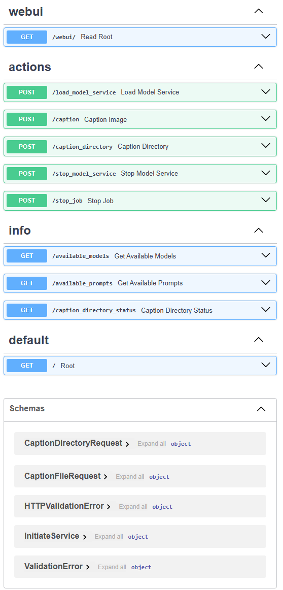
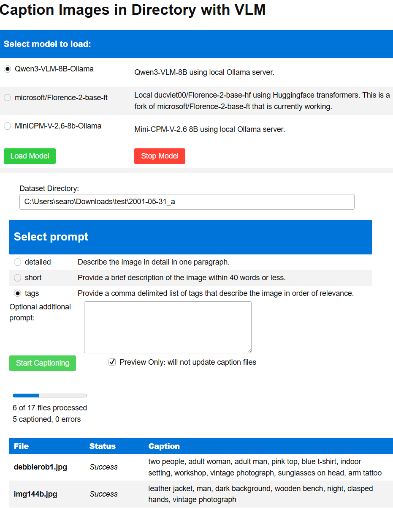

# Documentation
Below is the documentation for the VLM to Caption Images in Directory application. You can use this application to caption images in a directory using a Vision Language Model (VLM). The application provides a simple and intuitive interface (Web UI) to select a directory, choose a prompt, and generate captions for the images in the directory. You can run this as a command-line interface (CLI) with `program.py` or as a web service using FastAPI.

## CLI
If you run `python program.py`, you get a list of available options and brief usage instructions.
```bash
python program.py
usage: program.py [-h] --model MODEL --directory DIRECTORY --prompt PROMPT [--append_prompt APPEND_PROMPT]

VLM Caption Server

options:
  -h, --help            show this help message and exit
  --model MODEL         Model to use for captioning
  --directory DIRECTORY    Directory containing images to caption
  --prompt PROMPT       Prompt to use for captioning
  --append_prompt APPEND_PROMPT    Optional additional prompt to append

Available Models:
 - Qwen3-VLM-8B-Ollama: Qwen3-VLM-8B using local Ollama server.
 - microsoft/Florence-2-base-ft: Local ducviet00/Florence-2-base-hf using Huggingface transformers. This is a fork of microsoft/Florence-2-base-ft that is currently working.
 - MiniCPM-V-2.6-8b-Ollama: Mini-CPM-V-2.6 8B using local Ollama server.

Available Prompts:
 - detailed: Describe the image in detail in one paragraph.
 - short: Provide a brief description of the image within 40 words or less.
 - tags: Provide a comma delimited list of tags that describe the image in order of relevance.
```

Example 
```bash
python program.py --model Qwen3-VLM-8B-Ollama --directory "C:\Users\searo\Downloads\test\2001-05-31_a" --prompt tags
Found 17 images in directory 'C:\Users\searo\Downloads\test\2001-05-31_a'.
Processing images...
Image: img144b.jpg
Caption: person, black leather jacket, vintage, outdoor, wooden bench, dark background, standing, hands clasped

Image: img267.jpg
Caption: man, work shirt, name tag, industrial workshop, Coca-Cola can, glasses, brick wall, workbench, tools, vintage photograph
```


## Web Service
To run this as a web service so that other programs can interact with it, you can run the following command:
```bash
uvicorn server:app --reload
```
This will start the FastAPI server on port 8000. You can then access the web interface at `http://localhost:8000`.
To can view the Swagger UI generated documentation at `http://localhost:8000/docs` and you can also test the endpoints of the API.

FastAPI Swagger UI Docs Screenshot:



### API Endpoints
This web service provides the following API endpoints:

#### /available_prompts
- `GET /available_prompts`: Get a list of available prompts.
Example response:
```json
{
  "available_prompts": {
    "detailed": "Describe the image in detail in one paragraph. Response should be text only without Markdown.",
    "short": "Provide a brief description of the image within 40 words or less.",
    "tags": "Provide a comma delimited list of tags that describe the image in order of relevance."
  }
}
```

#### /available_models
- `GET /available_models`: Get a list of available models.
Example response:
```json
{
  "available_models": {
    "Qwen3-VLM-8B-Ollama": "Qwen3-VLM-8B using local Ollama server.",
    "microsoft/Florence-2-base-ft": "Local ducviet00/Florence-2-base-hf using Huggingface transformers. This is a fork of microsoft/Florence-2-base-ft that is currently working.",
    "MiniCPM-V-2.6-8b-Ollama": "Mini-CPM-V-2.6 8B using local Ollama server."
  }
}
```

#### /caption_directory_status
- `GET /caption_directory_status`: Get the status of the current captioning job.
Example response:
```json
{
    "total_files": 17,
    "processed_files": 6,
    "captioned_files": 5,
    "error_count": 0,
    "file_statuses": {
        "img144b.jpg": {
            "status": "Success",
            "message": "leather jacket, man, dark background, wooden bench, night, clasped hands, vintage photograph"
        },
        "img267.jpg": {
            "status": "Success",
            "message": "man, work shirt, name tag, workshop, industrial setting, brick wall, tools, Dr Pepper, yellow structure, glasses, vintage"
        },
        "img275.jpg": {},
        "img276.jpg": {},
        ...
    }
}
```


#### /caption_directory
- `POST /caption_directory`: Caption images in a directory. Requires a JSON body with the following fields:
  - `directory`: The local directory containing images to caption.
  - `prompt`: The prompt code to use for captioning. (detailed|short|tags)
  - `append_prompt`: Optional additional prompt to append. (string)
  - `previewDoNotUpdate`: Boolean to indicate whether to only preview captions without actually updating text files.

Example POST request body:
```json
{
  "directory": "D:\\path\\to\\images",
  "prompt": "detailed",
  "append_prompt": "Focus on the main subject",
  "previewDoNotUpdate": false
}
```
Example response:
```json
{
    "message": "Captioning process started in the background",
    "files": [
        "img144b.jpg",
        "img267.jpg",
        "img268.jpg",
        ...
    ]
}
```


#### /load_model_service
- `POST /load_model_service`: Load a model service. Requires a JSON body with the following field:
  - `service_model`: The model service to load. (microsoft/Florence-2-base-ft|MiniCPM-V-2.6-8b-Ollama)

Example POST request body:
```json
{
  "service_model": "microsoft/Florence-2-base-ft"
}
```
Example response:
```json
{
  "message": "Service 'microsoft/Florence-2-base-ft' started successfully"
}
```

#### /stop_model_service
- `POST /stop_model_service`: Stop the current model service.

Example response:
```json
{
  "message": "Model service stopped"
}
```

#### /stop_job
- `POST /stop_job`: Stop the current captioning job.

Example response:
```json
{
  "message": "Job stopped"
}
```

#### /caption
- `POST /caption`: Generate a caption response for a single image, but it does not create a caption text file. Requires a JSON body with the following fields:
  - `image_path`: The path to the image to caption.
  - `prompt`: The prompt code to use for captioning. (detailed|short|tags)
  - `append_prompt`: Optional additional prompt to append. (string)

Example POST request body:
```json
{
  "image_path": "D:\\path\\to\\image.jpg",
  "prompt": "tags",
  "append_prompt": ""
}
```
Example response:
```json
{
  "caption": "leather jacket, man, dark background, wooden bench, night, clasped hands, vintage photograph"
}
```

## Web UI
With this web page, you can interact with the API through a user-friendly interface and select the options to generate captions for images in a directory. To view the web UI, navigate to `http://localhost:8000/webui` in your web browser.

Web UI screenshot:


The first thing to do is select the model service you want to use from the dropdown menu, and click the Load Model button. If you already have another model loaded, you can click the Stop Model button to stop it. If it's using Ollama as the service host, then Ollama might not unload it right away. Don't worry, it will unload it when you start the new model.

After clicking "Load Model", a form will display below. In the Dataset Directory textbox, enter the directory path where your images are located. Select the appropriate prompt. If you want to append additional text to the prompt, you can enter it in the "Optional additional prompt" textbox. There is a "Preview Only" checkbox which means that it will respond with the generated captions, but it will not create corresponding caption text files or overwrite the existing ones. When you click the "Start Captioning" button, the captioning job will begin. It might take a while for the model to truely load, but it will be quicker aftwerwards. A progress bar and status message will be displayed to show the progress of the captioning job. Below that will be a table of files, statuses, and generated captions.
